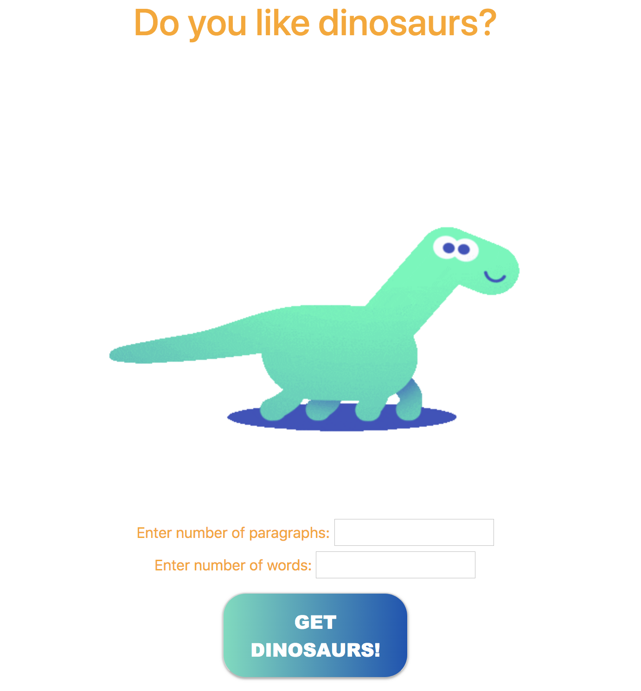

# _Dino Ipsum_

#### _An application to practice using API calls with the Dino Ipsum API. , Feb 2020_

#### By _**Benjamin Thom and Kristina Hengster Tintor**_

## Description

Input a number of paragraphs, and a number of words per paragraph and press "Give me dinos!" to display a Dino Ipsum.

## Preview

Click here for Live Preview: http://kristinaht.github.io/dino


## Project Specifications

| Behavior | Input | Output |
|---|:---:|:---:|
|User inputs number of paragraphs|2|2 paragraphs|
|User inputs number os worsd per paragraph|5|5 words per paragraph|
|User clicks "Show me dinos!" button and is shown results from Dino Ipsum API|Button click|Display: <P>Lophorhothon Pachysauriscus Lagosuchus Chuanjiesaurus Astrodonius.</P> <p>Marisaurus Berberosaurus Aniksosaurus Probactrosaurus Hesperosaurus.</p>|
||||

## Setup/Installation Requirements

_In Terminal:_

* Navigate to where you want this application to be saved, i.e.:
```cd desktop```
* Clone the file from GitHub with HTTPS
```git clone https://github.com/kristinaht/dino.git```
* Open file in your preferred text editor
* On Mac: ```open -a {your text editor} dino```
* On Windows: ```dino```

_Download Manually:_

* Navigate to https://github.com/kristinaht/dino.
* Click green "Clone or Download" button.
* Click "Download ZIP".
* Click downloaded file to unzip.
* Open folder called "dino".
* Right click "index.html" and select your preferred browser or text editor.

_Note For Editors:_ 
* Once cloned/downloaded, to run and make changes, in the terminal simply run **$ npm install** to download necessary dependencies
* Run **$ npm run build** to create your own dist folder with a bundle.js file
* Obtain API key from (API website link)
* Create .env file in the root directory of (project name)
* Add API key to .env file (EX: API_KEY: your API key here)
* Add .env file to .gitignore file (*important*)
* The API key will now be refrenced within the (project name)-interface.js file
* Lastly, run **$ npm run start** to run application

## Known Bugs

_No known bugs at this time._

## Support and contact details

_Have a bug or an issue with this application? [Open a new issue](https://github.com/kristinaht/dino) here on GitHub._

## Technologies Used

* HTML
* CSS
* Bootstrap
* Javascript
* jQuery
* Webpack
* Node.js
* (API Name)

### License

[MIT](https://choosealicense.com/licenses/mit/)

Copyright (c) 2020 **_Benjamin Thom and Kristina Hengster Tintor_**